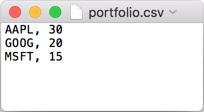
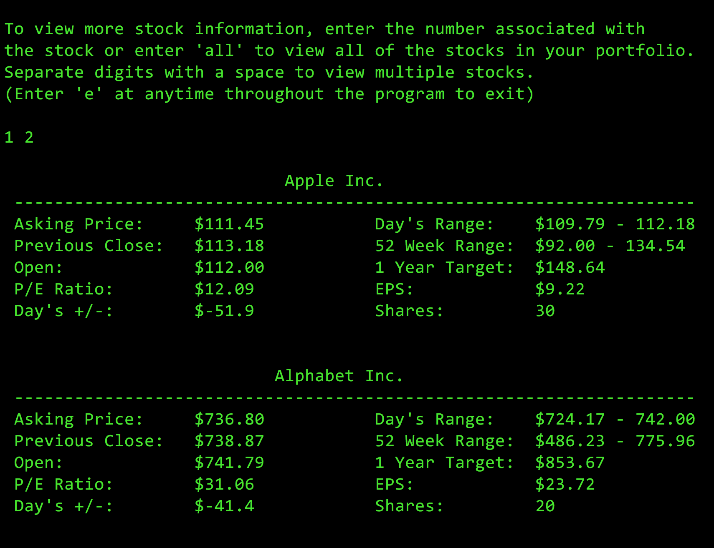
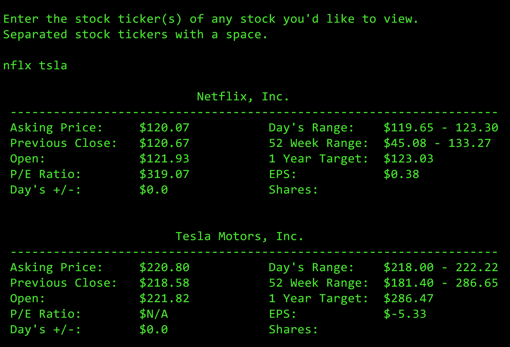

## Stock Gains

This Ruby gem uses the Yahoo Finance API to provide three valuable stock market functions for the user. First, it imports the users portoflio from a `CSV` file, calculates each stocks earnings/losses for the day, then returns the total balance your portfolio has earned/lost. Next, it gives the user the option to display generic stock information of any or all of the stocks in their portfolio. Lastly, it allows the user to lookup stock data of any stock(s) of their choosing.  

## Installation

You can install this gem via `gem install stock-gains`. Before you run this app you'll need to set up a `CSV` file containing all of the stocks in your portfolio so they can be imported into the app. Start by cloning the respository to your local computer. Then, on the top-level of the directory, create a file called `portfolio.csv` and insert the stock ticker followed by the quantity of shares you hold for each stock in your portfolio. Be sure to input each stock on a new line and separate the two values by a comma (see the diagram below). Now run `stock-gains` in the CLI to view your gains! 

## Usage

### Today's Gain/Loss

What makes Stock Gains useful is that not only does it compute what each individual stock in your portfolio has earned/lost for that day, it computes the total balance your *portfolio* has earned/lost for that day. These calculations are displayed for the user in the following table:

### Stock Information

The user then has the option to view additional stock information regarding any stock in their portfolio. There are four possible entries:

  * Enter `all` to display stock data regarding all of the stocks in your portfolio
  * Enter the digit, or digits, corresponding to the stocks in your portfolio that you want to lookup (separated by a space)
  * Press enter to move onto the next stage 
  * Enter `e` to exit the program

### Stock Lookup

Finally, lookup any stock on the market by entering the stock ticker. To view multiple stocks, separate the stock tickers with a space.

## Contributing 

1. Fork it!
2. Create your feature branch: git checkout -b my-new-feature
3. Commit your changes: git commit -am 'Add some feature'
4. Push to the branch: git push origin my-new-feature
5. Submit a pull request :D

## Development 

After checking out the repo, run `bundle exec bin/setup` to install dependencies.

## License 

The gem is available as open source under the terms of the MIT License.
